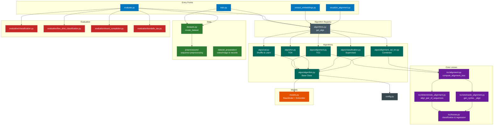
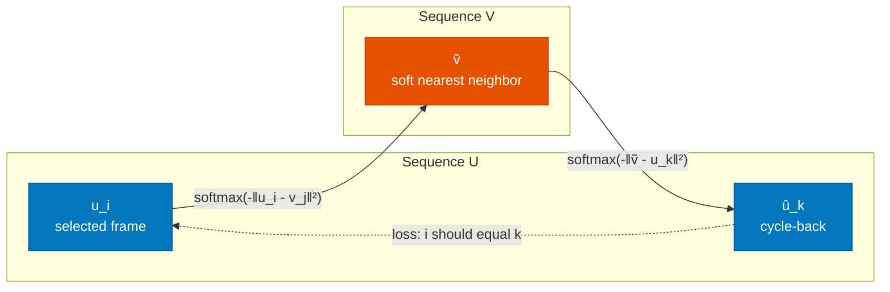
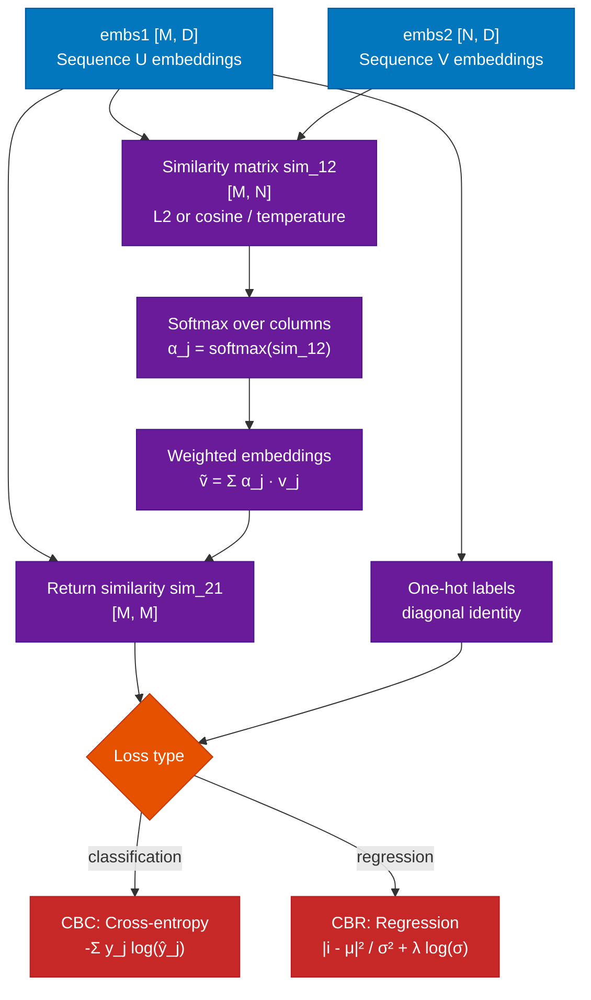
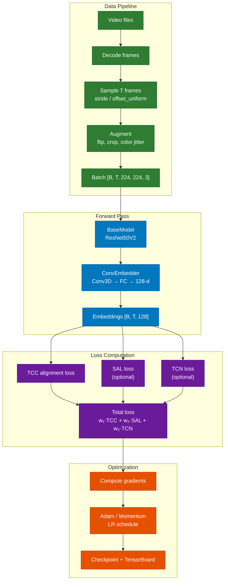
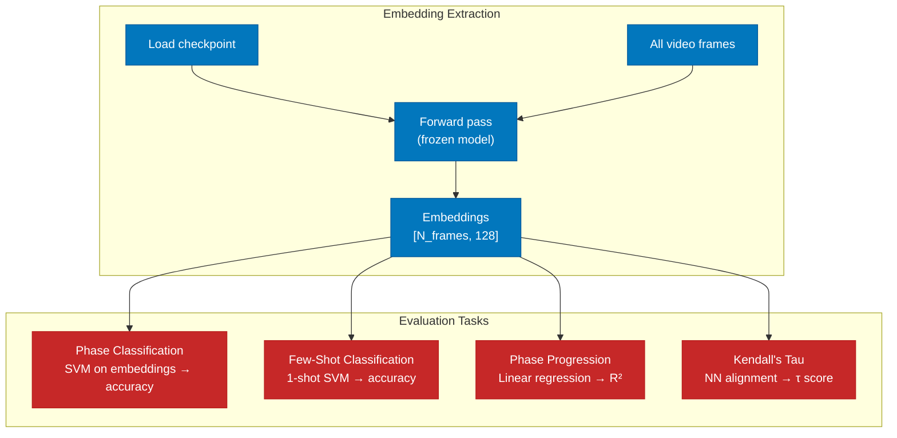
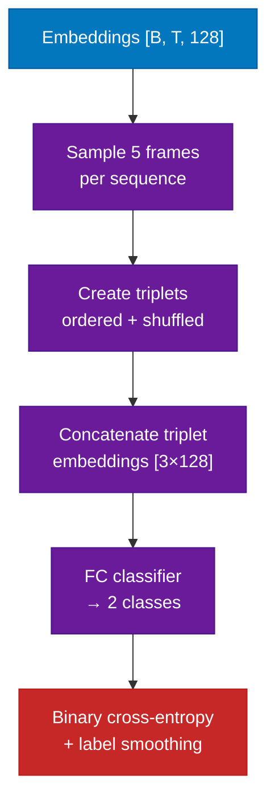
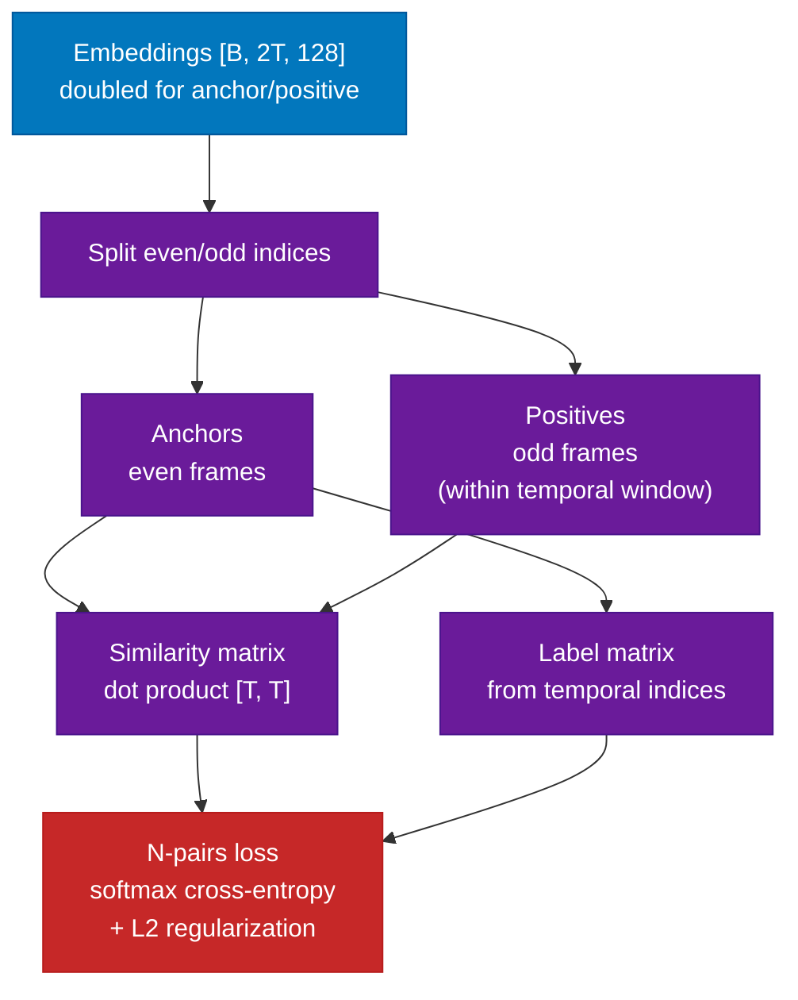
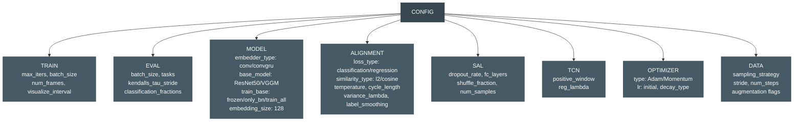

# TCC Architecture

Architecture documentation for the Temporal Cycle-Consistency Learning codebase.

**Papers:**
- [Temporal Cycle-Consistency Learning](https://arxiv.org/abs/1904.07846) (Dwibedi et al., CVPR 2019)
- [Time-Contrastive Networks](https://arxiv.org/abs/1704.06888) (Sermanet et al., 2017)

## Module Dependency Diagram



## Embedding Network Architecture

The embedder transforms raw video frames into 128-dimensional embeddings used for alignment.

```mermaid
graph LR
    subgraph Input
        FR["Frames<br/>[B, T, 224, 224, 3]"]
    end

    subgraph "BaseModel (ResNet50V2)"
        R5["ResNet50V2<br/>pretrained ImageNet"]
        CF["Conv4c features<br/>[B, T, 14, 14, 1024]"]
    end

    subgraph "ConvEmbedder"
        CX["Context stacking<br/>k-1 neighbor frames"]
        C3["Conv3D layers<br/>temporal aggregation"]
        MP["3D MaxPooling"]
        F1["FC 512 + ReLU"]
        F2["FC 512 + ReLU"]
        LP["Linear projection"]
        LN["L2 Normalize"]
    end

    subgraph Output
        EM["Embeddings<br/>[B, T, 128]"]
    end

    FR --> R5 --> CF --> CX --> C3 --> MP --> F1 --> F2 --> LP --> LN --> EM

    classDef input fill:#0277bd,color:#fff,stroke:#01579b
    classDef backbone fill:#e65100,color:#fff,stroke:#bf360c
    classDef embedder fill:#6a1b9a,color:#fff,stroke:#4a148c
    classDef output fill:#2e7d32,color:#fff,stroke:#1b5e20

    class FR input
    class R5,CF backbone
    class CX,C3,MP,F1,F2,LP,LN embedder
    class EM output
```



**Alternative embedder:** ConvGRUEmbedder replaces Conv3D + MaxPool with Conv2D per frame followed by GRU layers for temporal modeling.

## TCC Loss Computation

The core TCC loss enforces cycle-consistency across video pairs through soft nearest neighbor matching.

### Cycle-Consistency Principle



### Deterministic Alignment Pipeline



### Loss Variants

**Cycle-Back Classification (CBC):**
Cross-entropy loss on the cycle-back logits, treating each frame position as a class.

```
L_cbc = -Σⱼ yⱼ log(ŷⱼ)
```

**Cycle-Back Regression (CBR):**
Fits a Gaussian to the cycle-back distribution and penalizes distance from the true index with variance regularization.

```
β = softmax(logits)
μ = Σ(steps · β)        # predicted time index
σ² = Σ(steps² · β) - μ² # predicted variance
L_cbr = |i - μ|² / σ² + λ · log(σ)
```

CBR with λ=0.001 outperforms CBC and MSE variants (paper ablation).

### Stochastic vs Deterministic

| Mode | Description |
|------|------------|
| **Deterministic** | Aligns all N*(N-1) pairs in batch. Concatenates logits/labels from all pairs. |
| **Stochastic** | Generates random cycles of configurable length (2+). Randomly selects frames and cycles through sequences. More scalable for large batches. |

## Training Pipeline



### Training Configuration

| Parameter | Default | Notes |
|-----------|---------|-------|
| Image size | 224×224 | ResNet50 input |
| Embedding dim | 128 | L2-normalized |
| Context frames | k (configurable) | Temporal context for Conv3D |
| Batch size | configurable | N sequences per batch |
| Optimizer | Adam / Momentum | With LR decay (fixed/exp/manual) |
| Similarity | L2 or cosine | Scaled by temperature |
| Loss type | CBR (regression_mse_var) | Best performing variant |

## Evaluation Pipeline

Evaluation extracts frozen embeddings and trains lightweight classifiers on top — no fine-tuning of the pretrained model.



### Evaluation Tasks

| Task | Method | Metric | Description |
|------|--------|--------|-------------|
| Phase Classification | SVM on embeddings | Accuracy | Classify action phase per frame |
| Few-Shot Classification | 1-shot SVM | Accuracy | Single labeled video for training |
| Phase Progression | Linear regression | R² | Predict fraction of task completion |
| Kendall's Tau | NN alignment | τ ∈ [-1, 1] | Temporal concordance between video pairs |

## Shuffle and Learn (SAL) Loss

SAL trains the embedder to distinguish temporally ordered from shuffled frame sequences.



**Algorithm:**
1. Randomly select 5 frame indices from each sequence
2. Form ordered triplets (f₁, f₂, f₃) where f₁ < f₂ < f₃
3. Form shuffled triplets by swapping positions
4. Concatenate 3 frame embeddings → 384-dim vector
5. FC classifier predicts ordered vs shuffled → binary cross-entropy

## TCN (Time-Contrastive Networks) Loss

TCN uses an N-pairs metric learning loss on temporally sampled anchor/positive frame pairs.



**N-pairs loss:**
```
L_tcn = softmax_cross_entropy(anchors · positives^T, labels) + λ · (‖anchors‖² + ‖positives‖²)
```

The positive window controls how far apart anchor/positive frames can be temporally. L2 regularization (λ) prevents embedding collapse.

## Combined Loss (TCC + SAL + TCN)

The combined algorithm (`alignment_sal_tcn`) computes a weighted sum:

```
L_total = w_align · L_tcc + w_sal · L_sal + w_tcn · L_tcn
```

Weights are configurable via `CONFIG.ALIGNMENT_SAL_TCN.ALIGNMENT_LOSS_WEIGHT` and `SAL_LOSS_WEIGHT`. The paper shows that TCC+TCN achieves the best performance on fine-grained temporal tasks.

## Configuration Structure



## PyTorch Migration Map

Key TensorFlow → PyTorch equivalences for the port:

| TensorFlow | PyTorch | Used in |
|------------|---------|---------|
| `tf.keras.Model` | `nn.Module` | All algorithm/model classes |
| `tf.nn.l2_normalize` | `F.normalize` | Embedding normalization |
| `tf.nn.softmax` | `F.softmax` | Soft nearest neighbor |
| `tf.matmul` | `torch.matmul` / `@` | Similarity computation |
| `tf.GradientTape` | `loss.backward()` | Training loop |
| `tf.stop_gradient` | `.detach()` | Loss computation |
| `tf.data.TFRecordDataset` | `torch.utils.data.Dataset` | Data loading |
| `tf.keras.layers.Conv3D` | `nn.Conv3d` | Temporal convolutions |
| `tf.keras.layers.Dense` | `nn.Linear` | FC layers |
| `CuDNNGRU` | `nn.GRU` | ConvGRU embedder |
| `tf.distribute.MirroredStrategy` | `DistributedDataParallel` | Multi-GPU |
| `tf.summary` | `torch.utils.tensorboard` | Logging |
| `tf.keras.backend.learning_phase()` | `model.train()/eval()` | Train/eval mode |
| `tf.image.*` augmentations | `torchvision.transforms` | Data augmentation |
| EasyDict config | dataclasses / OmegaConf | Configuration |
